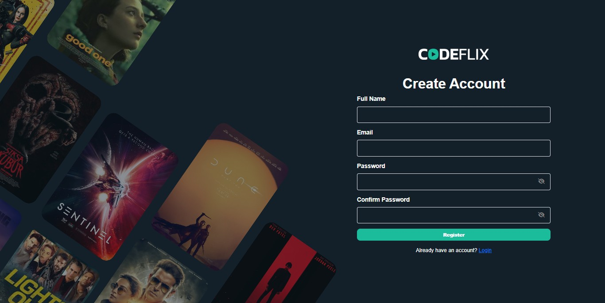

# Codeflix - Netflix-like Video Streaming System

Codeflix is a web application project built to simulate a video streaming platform like Netflix. Developed using **Laravel 12**, this project demonstrates the implementation of core features found in modern video-on-demand services, including user management, subscription systems, a movie catalog, and payment integration.

## Key Features

Here are some of the key features implemented in Codeflix:

* **User Authentication:**
    * New user registration.
    * Login for registered users.
    * Forgot Password and Password Reset functionality (using Laravel Fortify).
* **Subscription Management:**
    * Subscription plan selection during registration or after login.
    * Checkout page for subscription payments.
    * User redirection based on subscription status after login/registration.
* **Movie Catalog:**
    * Display list of movies based on categories.
    * Showcase Latest Movies and Trending Movies.
    * Detailed view page for each movie.
    * Movie search functionality by title.
    * "All Movies" page with a *load more* feature.
* **Payment Gateway Integration:**
    * Implemented payments using **Midtrans Snap** for a seamless checkout process.
    * Webhook/Callback listener to handle payment status notifications from Midtrans.
* **Membership Status Checks:**
    * Automated scheduler (using Laravel Scheduler & Jobs) to periodically check user subscription validity.
    * Custom command to run checks manually if needed.
    * Automatic email notifications (using Laravel Mail & Notifications) to users whose subscriptions are expiring or have expired.
* **Database Structure:**
    * Relational database design to manage users, plans, subscriptions, movies, categories, and ratings.
    * Uses Laravel Migrations to create the table structure.
    * Uses Laravel Seeders to populate initial/dummy data.

## Technology Stack

* **Backend:** PHP 8.2+, Laravel 12
* **Database:** MySQL / PostgreSQL (adjust according to your setup)
* **Authentication:** Laravel Fortify
* **Payment Gateway:** Midtrans (Snap API)
* **Dependency Manager:** Composer
* **Task Scheduling:** Laravel Scheduler
* **Queue & Jobs:** Laravel Queues (for background tasks like notifications)
* **Email:** Laravel Mail & Notifications

## Installation & Setup

To run this project in your local environment, follow these steps:

1.  **Clone the Repository:**
    ```bash
    git clone https://github.com/rendrazuriansyah/codeflix.git
    cd codeflix
    ```

2.  **Install Dependencies:**
    ```bash
    composer install
    npm install # or yarn install (if using asset bundling)
    npm run dev # or yarn dev (if using asset bundling)
    ```

3.  **Configure Environment:**
    * Copy the `.env.example` file to `.env`:
        ```bash
        cp .env.example .env
        ```
    * Open the `.env` file and adjust the following configurations:
        * `DB_CONNECTION`, `DB_HOST`, `DB_PORT`, `DB_DATABASE`, `DB_USERNAME`, `DB_PASSWORD` (match your local database setup).
        * `MIDTRANS_CLIENT_KEY`, `MIDTRANS_SERVER_KEY`, `MIDTRANS_MERCHANT_ID` (obtain from your Midtrans Sandbox/Production account).
        * `MAIL_MAILER`, `MAIL_HOST`, `MAIL_PORT`, `MAIL_USERNAME`, `MAIL_PASSWORD`, `MAIL_ENCRYPTION`, `MAIL_FROM_ADDRESS`, `MAIL_FROM_NAME` (configure for sending email notifications).

4.  **Generate Application Key:**
    ```bash
    php artisan key:generate
    ```

5.  **Run Migrations & Seeders:**
    * Create the database table structure:
        ```bash
        php artisan migrate
        ```
    * (Optional) Populate the database with initial/dummy data:
        ```bash
        php artisan db:seed
        ```

6.  **Setup Scheduler:**
    * To enable automatic membership checks, ensure you run the Laravel Scheduler. This typically involves adding a single cron entry to your server:
        ```cron
        * * * * * cd /path-to-your-project && php artisan schedule:run >> /dev/null 2>&1
        ```
    * For local development, you might run a queue worker (if jobs are dispatched to the queue) or manually run the scheduler command as needed.

7.  **Run the Application:**
    ```bash
    php artisan serve
    ```
    The application will typically be available at `http://localhost:8000`.

## Usage

1.  Open the application in your browser (`http://localhost:8000`).
2.  **Register** a new account or **Login** if you already have one.
3.  Select a **subscription plan** when prompted.
4.  Complete the **checkout** process (you will be redirected to Midtrans Snap).
5.  Once subscribed, browse the available **movie catalog**.
6.  Use the **search feature** to find specific movies.

## Screenshots

* *Login Page*
    
* *Registration Page*
    
* *Homepage*
    
* *Movie Detail Page*
    
* *Search Results Page*
    
* *Subscription Plans Page*
    
* *Payment Checkout Page*
    
* *Email Notification (Subscription Expired)*
    

## License

This project is licensed under the MIT License. See the [`LICENSE`](LICENSE) file for details.

---

_Built by Rendra ([https://github.com/rendrazuriansyah](https://github.com/rendrazuriansyah))_